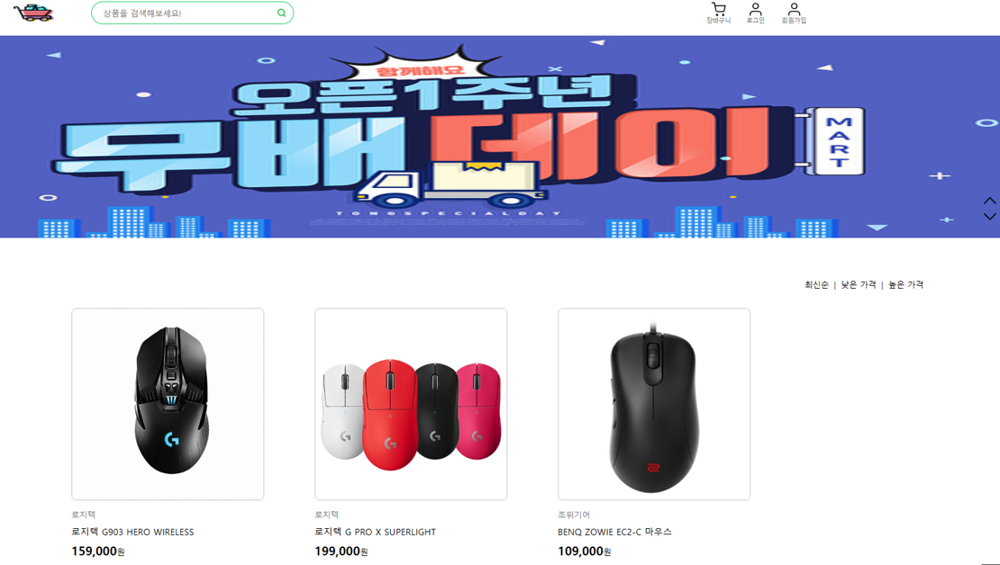

# 🚩 Shopping App

   
  
   

   
* 데모앱🎬 : https://sc-shoppingapp.netlify.app
   

  
## 📌 프로젝트 소개

   
  React를 사용해서 간단한 쇼핑몰을 구현했습니다.  
  React 이해도를 높여주고 React.js에 조금 더 익숙해진 계기가 되어 React Hook, React-router에 대한 개념을 더욱 확실하게 숙지할 수 있었습니다.

* 개발 인원: 1명(개인 프로젝트)
* Deployment : github
* React, React-Router-Dom, CSS Module

 

## 🔨 기술 스택

|    React    | 
| :--------:  |
|  ![react]   |

 

## 🔍 구현 기능

#### 이미지 슬라이드 

#### 아이템 차순 정렬 아이템 담기, 수량 증가, 감소에 따른 가격 동적 구현 

#### 장바구니에 체크된 아이템 삭제, 체크된 아이템만 가격 동적 구현 

#### 정규식을 통한 로그인 회원가입 페이지 구현

 

## ✏️ 배운 점 & 아쉬운 점

React를 사용해서 간단한 쇼핑몰을 구현했습니다.  
그동안 명확하게 이해하지 못했던 React에 맞춰서 설계하려고 노력했습니다. 컴포넌트로 구성돼 있고 하나의 컴포넌트는 다른 여러 개의 컴포넌트로 구성될 수 있고 마치 레고 블록을 조립하듯 컴포넌트들을 조립해서 개발할 수 있다는 점이 편의성을 느꼈습니다.  
정규식을 활용한 로그인, 회원가입 페이지 장바구니, 카트 페이지 이미지 슬라이드, 제품 순 정렬 등록할 수 있도록 구현했습니다.   
  또 React Router Dom, CSS Module에 대해서 배울 수 있어서 개발자로서 더욱 성장할 수 있는 프로젝트였습니다.   
  State 잘 관리하는 것이 중요한데 이것이 생각보다 어렵다고 느꼈습니다. 상태 관리를 위해서 Redux, Recoil 와 같은 상태 관리 라이브러리들을 사용을 하지 못해 아쉬움이 남습니다.

  

 

<!-- Stack Icon Refernces -->

[react]: public/images/Read_Me/react.svg
